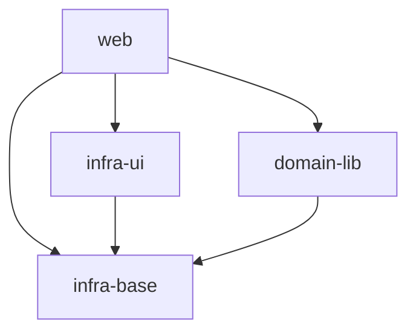

# Real-Life Grind

## Vision

Продукт помогает семье честно управлять обязанностями и поощрениями ребёнка через прозрачную систему правил и балльную экономику. Родители задают задачи, подтверждают выполнение и настраивают привилегии; ребёнок зарабатывает баллы через верифицированные действия, тратя их на согласованные покупки — от экранного времени до развлечений — формируя замкнутый цикл мотивации: усилие → балл → награда → новое усилие.

## Scope Graph

> `infra-ui` и `domain-lib` независимы: UI-кит не знает о домене, домен не знает об UI.

## Scopes

| Scope | Type | Spec | Description |
|---|---|---|---|
| [`infra-base`](./infra-base/infra-base.spec.md) | infrastructure | ✅ | **Фундамент сборки:** TypeScript, Vite, Svelte 5, Vitest, Playwright, Biome, lefthook, Firebase, PWA. Поставляет все dev-инструменты и скрипты проверок. |
| [`infra-ui`](./infra-ui/infra-ui.spec.md) | infrastructure | ✅ | **Дизайн-система и UI-кит:** Storybook 8, 19 Svelte 5/Melt UI компонентов, CSS design-токены, темизация. `web` потребляет UI-кит через `src/ui/index.ts`. |
| `domain-lib` | library | 🚧 | **Бизнес-логика:** 6 изолированных bounded-контекстов (Family, Tasks, Ledger, School, Store, Inbox). Не зависит от UI. Потребляется `web`. |
| `web` | product | 🚧 | **SPA-приложение:** Svelte 5, local-first PWA, Firebase-синхронизация. Зависит от `infra-base` (сборка), `infra-ui` (UIKit), `domain-lib` (логика). |

> **Легенда:** ✅ готов (discovery пройден) | 🚧 в работе (файл создан / запланирован) | ⬜ запланирован (файла нет)
> 
> _Обновлено: 2026-05-17_
