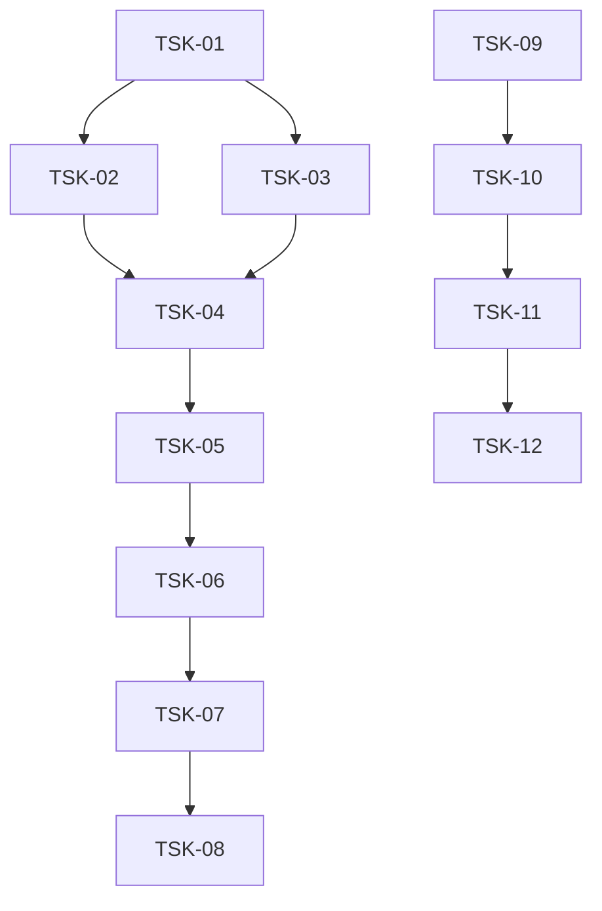

# Project Tasks

## Entry Points
- [Specs Portal](../specs/README.md) — Scope Graph + all scope specs.
- Tickets are executed ONLY via `sdd-execute` SKILL (single ticket) or `sdd-execute-batch` SKILL (queue). The orchestrator dispatches phase-subagents per ticket's Phases Overview, then `sdd-audit` automatically — operator does not invoke audit manually.

## Project-Wide Conventions

### File-header Convention
Per `AX_FILE_HEADER_TASK_TRACEABILITY` — canonical format, rules, and lang-agnostic note defined there.

### Completion Rule (baseline)
A task cannot transition to `[x] DONE` until ALL of (per `AX_DONE_REQUIRES_EVIDENCE`):
1. Every phase declared in section 2 Phases Overview has Status `[x]`.
2. Every BDD scenario mapped to test ownership in section 6 OR has `Deferred Test Ownership: <task-id>`.
3. Verification commands relevant to each phase executed; results + exit codes recorded in that phase's Execution Log block.
4. Canonical case names match real test cases or ticket updated.
5. `Deferred Runtime Scope` recorded if applicable.
6. Every introduced-beyond-Inventory entity logged as `<ts> intro <Name> ← <reason>` in the relevant phase block.
7. Every phase block ends with a typed **Handoff →** line.

Task-level additions live in each ticket's section 5.

### Execution Log Template
Per `AX_EXECUTION_LOG_PLAN_VS_FACT` (this directive) + `AX_LIVE_LOG` in `phase-execution-protocol`. Each Round = one execute-then-audit attempt; per-phase blocks within a Round; append-only; old Rounds NEVER edited.

**Action token vocabulary** (every log line starts with `<ts>` then exactly one token):
| Token | Meaning | Tail shape | Emitted by |
|---|---|---|---|
| `recon` | narrow recon at phase entry | `git=<branch>/<dirty?> targets=<state> divergence=<list\|none>` | phase agent |
| `rules` | rules loaded for this phase | comma-separated rule-ids | phase agent |
| `file` | wrote / modified production file | `` `<path>` `` | phase agent |
| `test` | wrote / modified test file | `` `<path>` `` | phase agent |
| `ver`  | verification command + result | `` `<cmd>` → <pass\|fail> exit=<code> `` | phase agent |
| `cov`  | scenario → test case mapping | `` <scenario> → `<test-file>::<case>` `` | phase agent (`test` kind) |
| `intro`| entity introduced beyond inventory | `` `<Entity>` ← <reason> `` | phase agent |
| `verified` | third-party tool API verified | `<tool>@<version> <summary>` | phase agent (`config` kind) |
| `insight` | spec-update proposal | `<observation> → <spec-section>, <change>` | phase agent |
| `sync` | tracker sync at Round close | `<scope>+root` | orchestrator |
| `DONE` | terminal state (phase or Round close) | (no tail) | phase agent / orchestrator |

Rules: token is the first non-whitespace word after `` `<ts>` ``; no label colons; no «Task initialized» line (Round header carries it); no `Status:` line (the `[x]` checkbox IS the status).

**Round structure:**
```markdown
### Round N — YYYY-MM-DD, <reason>
<!-- reason: "initial" | "audit-driven fix: F-NNN, F-MMM" | "late-detected bug: <area>" -->

#### P1
- [x] <ts> recon ...
- [x] <ts> rules ...
- [x] <ts> file ...
- [x] <ts> ver ... → pass exit=0
- [x] <ts> DONE
**Handoff →** artifacts: [...]; decisions: [...]; open: [...]

#### P2
... same shape ...

#### Round close
- [x] <ts> sync <scope>+root
- [x] <ts> DONE
```

⛔ `[x]` line with any unreplaced `<…>` literal = fabricated done; Auditor raises `EXECUTION_LOG_INCOMPLETE` (BLOCKER).

### Post-task Hook
Per `AX_AUDIT_HOOK`. After last phase of a Round closes, the orchestrator dispatches `sdd-audit`. Until audit returns PASS, Round is closed-but-unverified and dependents are blocked.

## High-Level DAG
Cross-scope edges + integration tickets only. Intra-scope DAGs live in per-scope READMEs.



## Tracker Index
| Scope | Type | Tracker | Tasks | Done |
|---|---|---|---|---|---|
| infra-base | infrastructure | [README](infra-base/README.md) | 4 | 3/4 (TSK-04 reopened) |
| infra-ui | infrastructure | [README](infra-ui/README.md) | 4 | 4/4 |
| infra-opencode-figma | infrastructure | [README](infra-opencode-figma/README.md) | 4 | 4/4 |

## Decision Log (scaffold)

### D-SC-001 — 4 задачи вместо 17 (укрупнение)
- **Status:** active
- **Recorded:** session Scaffold, infra-base
- **Why:** Оператор явно запросил не дробить задачи слишком мелко. Handoff предлагает 13 setup tasks + 7 bootstrap строк = потенциально 20 задач. Сгруппированы в 4 логических блока: Bootstrap (зависимости), Сборка (Vite/Svelte/TS/PWA), Качество (Biome/lefthook/Vitest/Playwright), Деплой (Firebase/env/CI/scripts).
- **Risk accepted:** Более крупные задачи сложнее отлаживать при падении в середине. Компенсируется фазовой структурой внутри каждого тикета (bootstrap → config → test).
