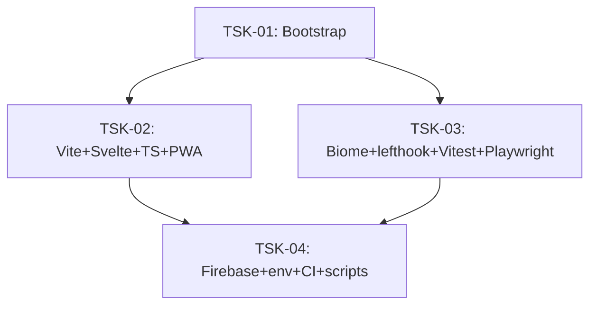

# Tasks: infra-base

## Scope Spec
- [Scope spec](../../specs/infra-base/infra-base.spec.md)

## Cascade Table
Effective rules for tasks in this scope. Derived from scope graph (depends-on transitive closure).

Tier order (low → high priority on collision): `traversed-scopes` → `target-scope` → `task`.

| Tier | coding | testing | infra |
|---|---|---|---|
| infra-base (target) | typescript-rules, svelte5-runes | vitest-rules, playwright-cli, playwright-e2e | nodejs-npm-setup, git-setup |

### Rule Sources
- Target scope: [infra-base spec 5](../../specs/infra-base/infra-base.spec.md#5-effective-rules-for-cascade)
- Files: `ai/directives/<category>/<rule>.xml`

## Intra-Scope DAG

## Tracker
| Task-ID | Title | Dependencies | Status | Reopens |
|---------|-------|--------------|--------|---------|
| [TSK-01](infra-base.task-01.md) | Bootstrap — npm-проект, зависимости, .gitignore | None | `[x]` DONE | 0 |
| [TSK-02](infra-base.task-02.md) | Конфигурация сборки — Vite, Svelte, TypeScript, PWA | TSK-01 | `[x]` DONE | 0 |
| [TSK-03](infra-base.task-03.md) | Конфигурация качества — Biome, lefthook, Vitest, Playwright | TSK-01 | `[x]` DONE | 0 |
| [TSK-04](infra-base.task-04.md) | Конфигурация деплоя — Firebase, .env, CI, скрипты | TSK-02, TSK-03 | `[!]` REOPEN | 1 |

## Notes
- Задачи укрупнены по решению D-SC-001 (оператор: «не дробить слишком мелко»).
- Все 4 задачи покрывают 13 setup tasks из Handoff спецификации infra-base.
- Bootstrap-зависимости (npm-пакеты) включены в TSK-01 единым блоком.
- **Pivot D-018 (2026-05-18):** TSK-04 переоткрыт — замена CI-деплоя (GitHub Actions) на ручной (`gh-pages`). GitHub Actions заблокирован из-за billing issue.
