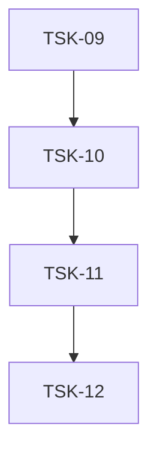

# Tasks: infra-opencode-figma

## Scope Spec
- [Scope spec](../../specs/infra-opencode-figma/infra-opencode-figma.spec.md)

## Blocking External Prerequisites
| Requirement | Owner | Status |
|---|---|---|
| `FIGMA_API_KEY` в окружении | operator-action | ✅ done (эта сессия) |
| `opencode.json` с блоком `mcp.figma` | operator-action | ✅ done (эта сессия) |

## Cascade Table
Effective rules for tasks in this scope. Derived from scope graph (depends-on transitive closure).

Tier order (low → high): `traversed-scopes` → `target-scope` → `module:<name>` → `task`.

| Tier | coding | testing | infra |
|---|---|---|---|
| infra-base (traversed) | `typescript-rules`, `svelte5-runes` | `vitest-rules`, `playwright-e2e` | `nodejs-npm-setup`, `git-setup` |
| infra-opencode-figma (target) | — | — | — |

### Rule Sources
- Traversed scopes: [scope graph](../../specs/README.md)
- Target scope: [infra-opencode-figma spec 5](../../specs/infra-opencode-figma/infra-opencode-figma.spec.md#5-effective-rules-for-cascade)
- Files: `ai/directives/<category>/<rule>.xml`

Примечание: задачи этого scope не производят исходный код — активируемые правила пусты для всех phases. Правила наследуются только для traceability.

## Intra-Scope DAG

## Tracker
| Task-ID | Title | Module | Dependencies | Status | Reopens |
|---------|-------|--------|--------------|--------|---------|
| [TSK-09](infra-opencode-figma.task-09.md) | Bootstrap figma-developer-mcp | N/A | — | `[x]` DONE | 0 |
| [TSK-10](infra-opencode-figma.task-10.md) | Configure MCP server + verify connection | N/A | TSK-09 | `[x]` DONE | 0 |
| [TSK-11](infra-opencode-figma.task-11.md) | Smoke-test Figma integration on real mockup | N/A | TSK-10 | `[x]` DONE | 0 |
| [TSK-12](infra-opencode-figma.task-12.md) | Document prompting conventions | N/A | TSK-11 | `[x]` DONE | 0 |

## Notes
- Все внешние prerequisites (FIGMA_API_KEY, opencode.json) уже выполнены в рамках discovery-сессии. TSK-09 стартует немедленно.
- Scope не добавляет своих правил — каскадная таблица содержит только traversed-правила из infra-base для traceability.
