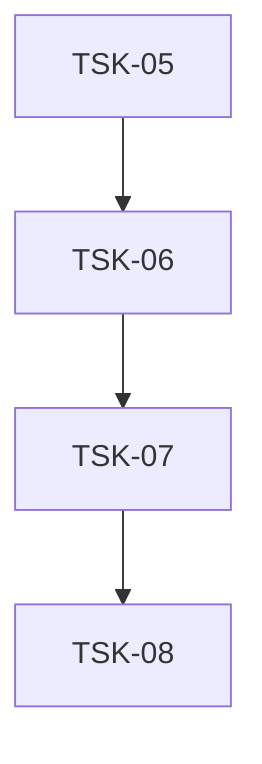

# Tasks: infra-ui

## Scope Spec
- [Scope spec](../../specs/infra-ui/infra-ui.spec.md)

## Cascade Table
| Tier | coding | testing | infra |
|------|--------|---------|-------|
| infra-base (traversed) | typescript-rules, svelte5-runes | vitest-rules | nodejs-npm-setup, git-setup |
| infra-ui (target) | — | — | — (deferred) |

### Rule Sources
- Traversed: [scope graph](../../specs/README.md)
- Target: [infra-ui spec §8](../../specs/infra-ui/infra-ui.spec.md#8-effective-rules-for-cascade)
- Files: `ai/directives/coding/typescript-rules.xml`, `ai/directives/coding/svelte5-runes.xml`, `ai/directives/testing/vitest-rules.xml`

## Intra-Scope DAG

## Tracker
| Task-ID | Title | Dependencies | Status | Reopens |
|---------|-------|--------------|--------|---------|
| [TSK-05](infra-ui.task-05.md) | Bootstrap: Storybook, токены, тема, скрипты | TSK-04 | [x] DONE | 0 |
| [TSK-06](infra-ui.task-06.md) | Primitives, Icons, Utils | TSK-05 | [x] DONE | 0 |
| [TSK-07](infra-ui.task-07.md) | Demo: проверка инфраструктуры на одном компоненте | TSK-06 | [x] DONE | 0 |
| [TSK-08](infra-ui.task-08.md) | Play-function stories + a11y tests | TSK-07 | [x] DONE | 0 |

## Notes
- TSK-05: пакеты + токены + конфиги. TSK-06: примитивы + иконки + lib.ts. TSK-07: демо-компонент. TSK-08: динамические play-function stories + a11y.
- Продуктовые компоненты (TaskCard, SlideToComplete, TabBar, ...) — зона `web`-скоупа.
